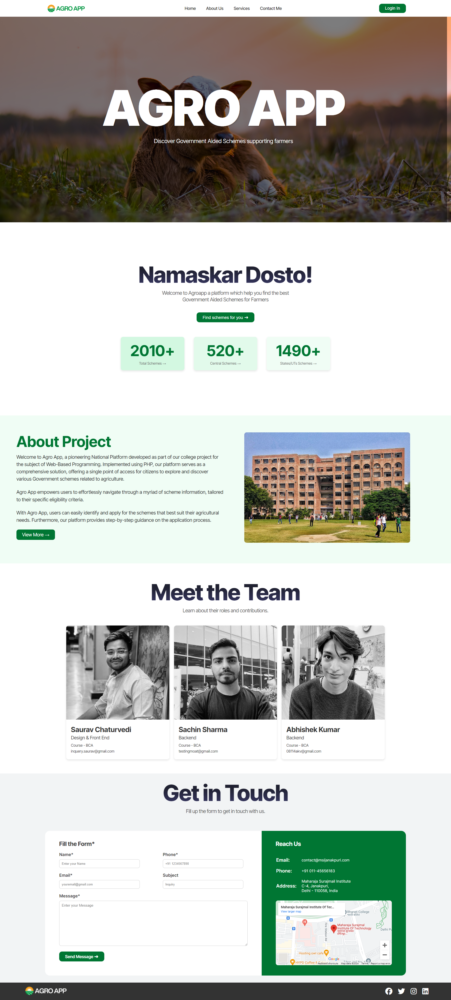

# Agro App - Government Aided Schemes for Farmers

This is a demo project created for a college project. It is a responsive website designed to help farmers discover Government Aided Schemes.

## Introduction

Agro App is a platform aimed at providing easy access to various Government schemes related to agriculture. This project was developed as part of a college project for the subject of Web-Based Programming.

## Features

- **Scheme Discovery**: Users can explore and discover various Government schemes supporting farmers.
- **Scheme Information**: Detailed information about each scheme, including eligibility criteria and application process.
- **User-Friendly Interface**: The platform is designed to be easy to navigate, ensuring users can find the information they need effortlessly.
- **Responsive Design**: The website is responsive, ensuring optimal viewing and interaction experience across a wide range of devices.

## Technologies Used

- **HTML**: Markup language used for structuring the web pages.
- **CSS**: Styling language used for enhancing the visual presentation.
- **JavaScript**: Used for interactivity and dynamic behavior.
- **PHP**: Backend scripting language used for server-side processing.

## Team Contact

- **Saurav Chaturvedi**: Design & Front End ([inquery.saurav@gmail.com](mailto:inquery.saurav@gmail.com))
- **Sachin Sharma**: Backend ([testingmoat@gmail.com](mailto:testingmoat@gmail.com))
- **Abhishek Kumar**: Backend ([08114akv@gmail.com](mailto:08114akv@gmail.com))

## Demo

You can view the demo of the Agro App website [here](https://sauravxcode.github.io/agroapp/). 

---

**Note:** The Backend File will be updated soon, This is a demo project created solely for educational purposes. It does not represent any real-world application or service.

## Preview

